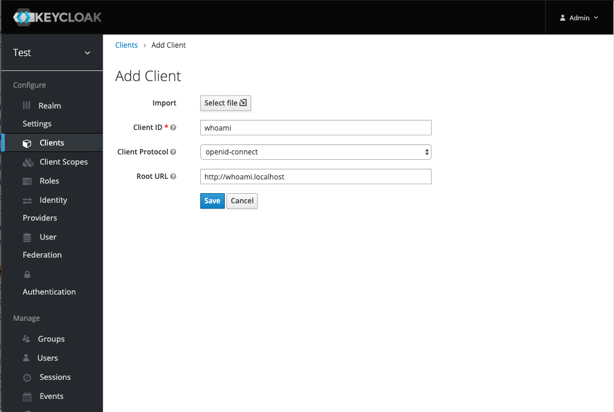
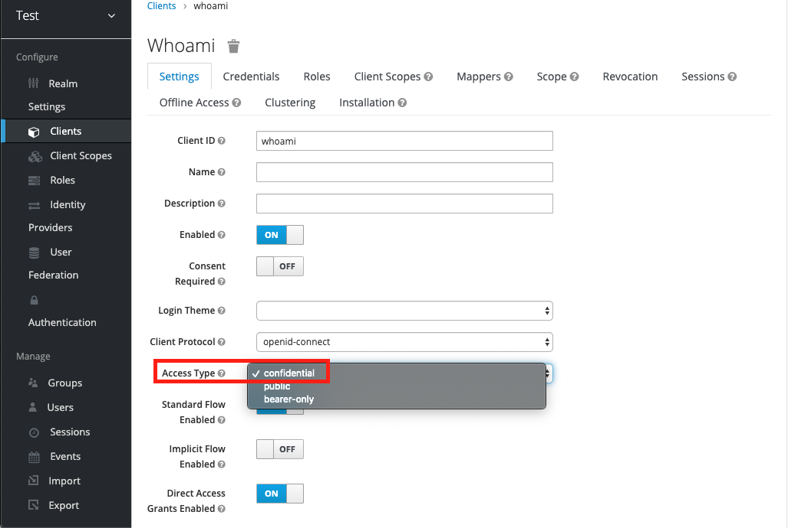
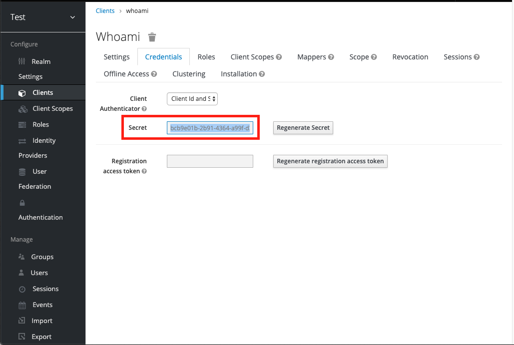
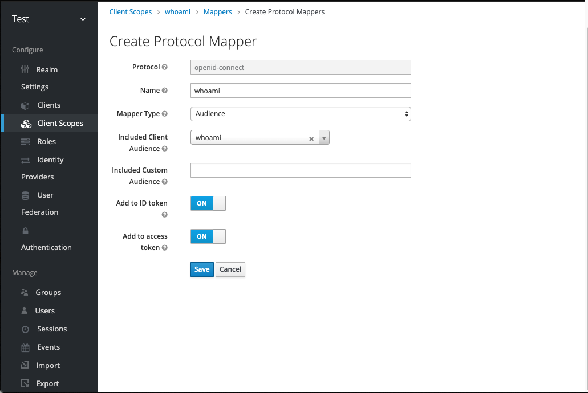

# Manual Keycloak Configuration

## Create client - whoami

1. Create client whoami

    |Field| Value|
    | -- | -- |
    | Client ID | whoami |
    | Client Protocol | openid-connect |
    | Root URL | http://whoami.localhost |

    

2. Edit client whoami

    |Field | Value|
    | -- | -- |
    | Access Type| confidential |

    

2. save

3. Go to credentials

4. Copy **Secret**, you need this value on gatekeeper config

    

## Create client scope - whoami

1. Create Client Scope whoami

    | Field | Value|
    | -- | -- |
    | Name | whoami |
    | Description | whoami |
    | Protocol | openid-connect |
    | Display On Consent screen | ON |
    | Consent Screen Text | |
    | Include In Token Scope | |
    | GUI order | |

    

2. save

3. create Audience mapper in the scope

    

    | Field | Value |
    | -- | -- |
    | Protocol | openid-connect |
    | Name | whoami |
    | Mapper Type | Audience |
    | Included Client Audience | whoami |
    | Included Custom Audience | |
    | Add to ID Token | ON |
    | Add to access token | ON |

    

4. save

## Associate client and client scope

1. Go to client whoami
2. Go to Client Scopes
3. Select "whoami" from "Available Client Scopes"
4. Click "Add selected" button

    
