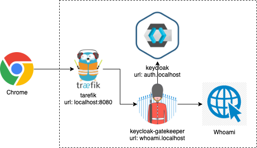
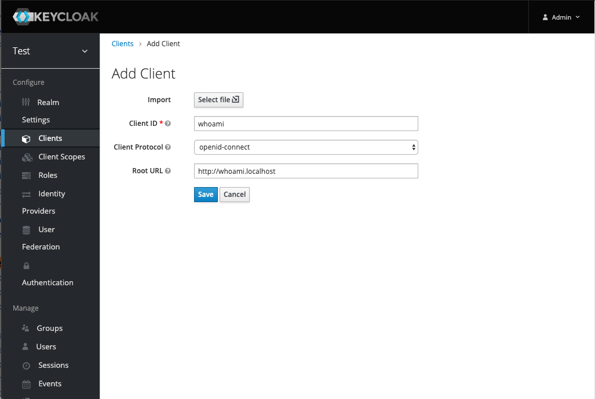
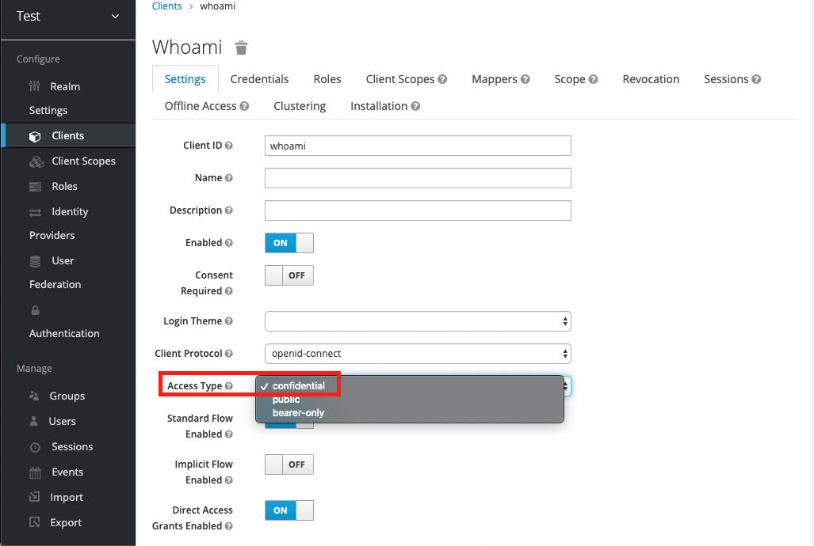
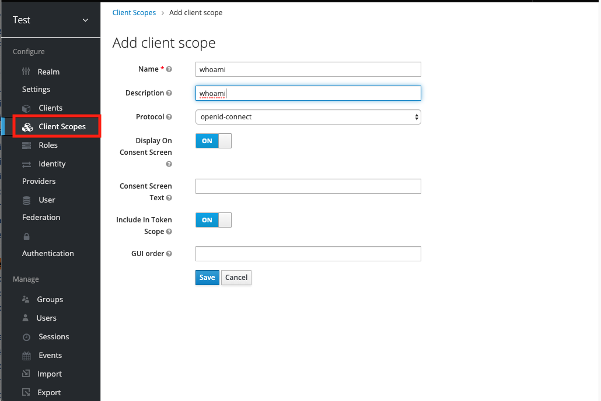
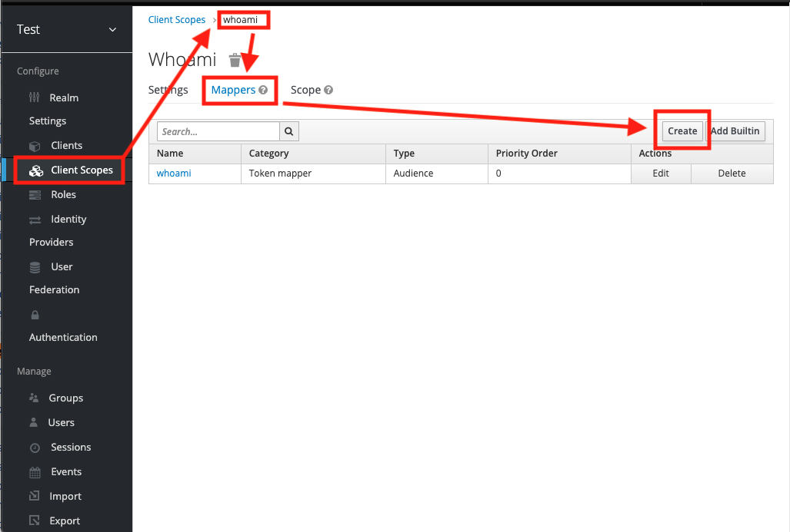
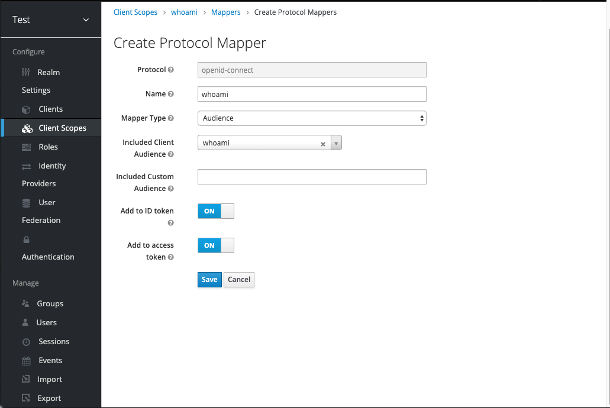
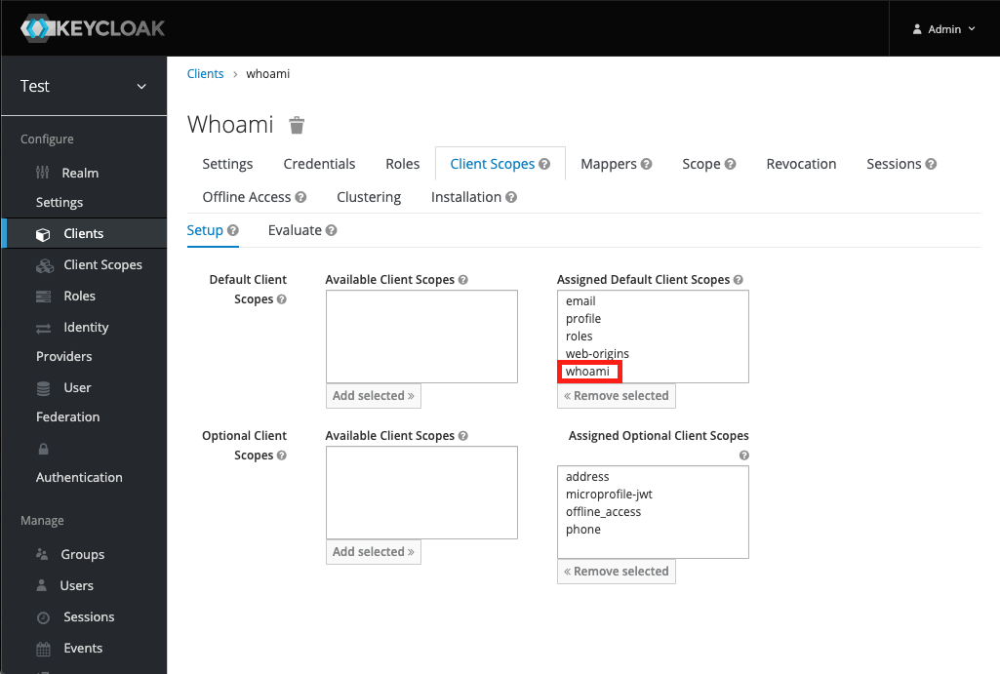
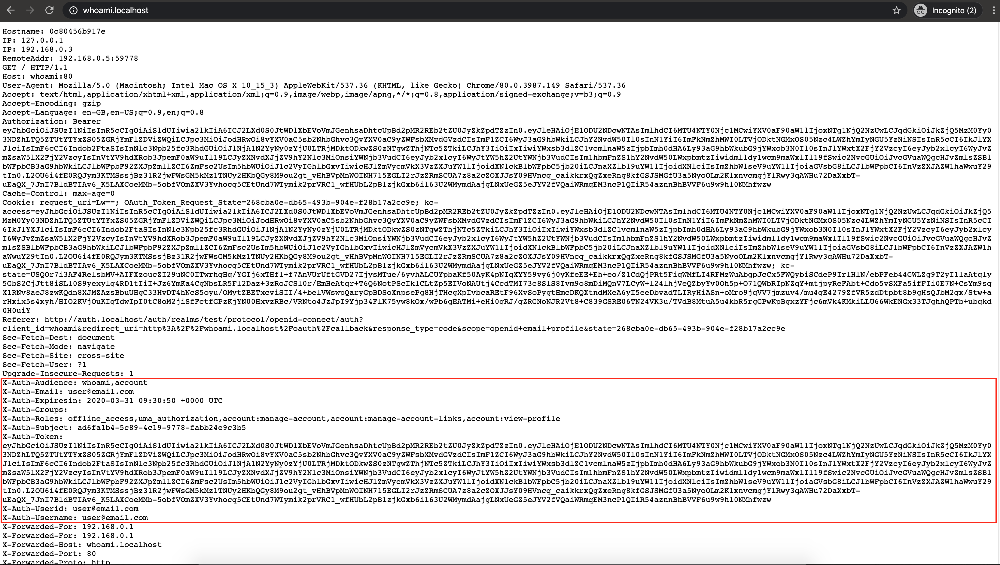

# Generic Keycloak Protection

This demo the use of keycloak gatekeeper to protect a simple web app. 

To start the demo, use the following command
```
docker-compose up -d
```

Archiecture of this setup



Components
1. traefik
2. keycloak
3. keycloak-gatekeeper
4. whoami (simple web app)

ps. you must use Chrome to open the link

## traefik

http://localhost:8080

## keycloak

http://auth.localhost


|Username | Password |
|--|--|
|admin|test|


We created a client, a client scope and associate the client and client scope to make this demo work.

You **DO NOT** need to carry out the steps below.

### Create client - whoami

1. Create client whoami

    |Field| Value|
    | -- | -- |
    | Client ID | whoami |
    | Client Protocol | openid-connect |
    | Root URL | http://whoami.localhost |

    

2. Edit client whoami

    |Field | Value|
    | -- | -- |
    | Access Type| confidential |

    

2. save

3. Go to credentials

4. Copy **Secret**, you need this value on gatekeeper config

    

### Create client scope - whoami

1. Create Client Scope whoami

    | Field | Value|
    | -- | -- |
    | Name | whoami |
    | Description | whoami |
    | Protocol | openid-connect |
    | Display On Consent screen | ON |
    | Consent Screen Text | |
    | Include In Token Scope | |
    | GUI order | |

    

2. save

3. create Audience mapper in the scope

    

    | Field | Value |
    | -- | -- |
    | Protocol | openid-connect |
    | Name | whoami |
    | Mapper Type | Audience |
    | Included Client Audience | whoami |
    | Included Custom Audience | |
    | Add to ID Token | ON |
    | Add to access token | ON |

    

4. save

### Associate client and client scope

1. Go to client whoami
2. Go to Client Scopes
3. Select "whoami" from "Available Client Scopes"
4. Click "Add selected" button

    

## keycloak-gatekeeper

http://whoami.localhost

|Username | Password |
|--|--|
|user@email.com|test|

After user is authenticated, http request will be proxy to whoami interface.

[Scuring App - Keycloak Gatekeeper](https://www.keycloak.org/docs/latest/securing_apps/index.html#_keycloak_generic_adapter)

## whoami

print the requeter's information, including request headers.

User and session info will be available in the request header

```
X-Auth-Audience: whoami,account
X-Auth-Email: user@email.com
X-Auth-Expiresin: 2020-03-31 09:30:50 +0000 UTC
X-Auth-Groups: 
X-Auth-Roles: offline_access,uma_authorization,account:manage-account,account:manage-account-links,account:view-profile
X-Auth-Subject: ad6fa1b4-5c89-4c19-9778-fabb24e9c3b5
X-Auth-Token: [Access Token]
X-Auth-Userid: user@email.com
X-Auth-Username: user@email.com
```

